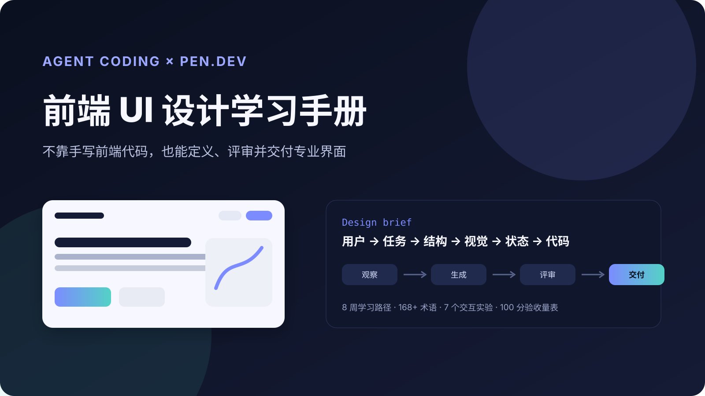
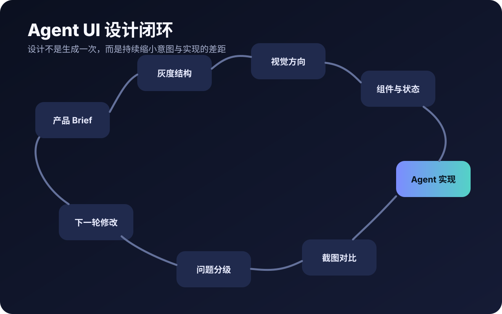

# Agent Coding × Pencil UI 设计学习手册


这不是一套“学会手写 HTML/CSS”的课程。它训练的是 **Frontend Design Literacy**：你能定义页面目标、看懂 UI 术语、指导 Agent、判断质量，并把设计落实成可用产品。


## 你会得到什么

<table data-view="cards">
<thead><tr><th></th><th></th><th data-hidden data-card-target data-type="content-ref"></th></tr></thead>
<tbody>
<tr><td><strong>先建立概念地图</strong></td><td>Hero、CTA、视觉层级、状态、响应式等术语不再陌生</td><td><a href="start/quick-start.md">start/quick-start.md</a></td></tr>
<tr><td><strong>再学 pen.dev 工作流</strong></td><td>用 Agent 在画布中探索、比较、评审，再生成代码</td><td><a href="pencil/mental-model.md">pencil/mental-model.md</a></td></tr>
<tr><td><strong>完成 8 周训练</strong></td><td>每周都有产出、验收标准与可复制 Prompt</td><td><a href="learning-plan/overview.md">learning-plan/overview.md</a></td></tr>
<tr><td><strong>动手做 UI Lab</strong></td><td>通过可操作 HTML 页面观察设计原则如何改变体验</td><td><a href="labs/README.md">labs/README.md</a></td></tr>
</tbody>
</table>

## 学习闭环



- HTML/CSS 语法细节
- React Hooks 与构建工具
- 复杂设计软件操作
- 完整企业级 Design System 治理


- 定义用户、任务与页面单一目标
- 判断信息架构与视觉层级
- 检查交互状态、响应式和无障碍
- 把模糊审美意见改写成可执行修改



## 先试一个交互实验

下面的 Hero Lab 可切换“标题主导、产品主导、证据主导”三种首屏层级。若 GitBook 将它显示为链接卡片，请点击打开实验页面。



<a class="button primary" href="https://raw.githack.com/Cafeynman/agent-ui-design-gitbook/main/labs/hero-hierarchy/index.html">打开 Hero 视觉层级实验</a>

## 推荐阅读顺序



### 1. 30 分钟快速入门

阅读[快速入门](start/quick-start.md)和[页面解剖](foundations/page-anatomy.md)。


### 2. 建立判断框架

阅读[视觉层级](foundations/visual-hierarchy.md)、[状态设计](foundations/interaction-states.md)与[响应式和无障碍](foundations/responsive-accessibility.md)。


### 3. 把判断接入 pen.dev

按照[pen.dev 心智模型](pencil/mental-model.md)和[标准工作流](practice/standard-workflow.md)完成第一次设计迭代。


### 4. 按 8 周计划持续训练

每周完成一个明确产出，并使用[100 分验收量表](practice/review-and-scoring.md)复盘。


