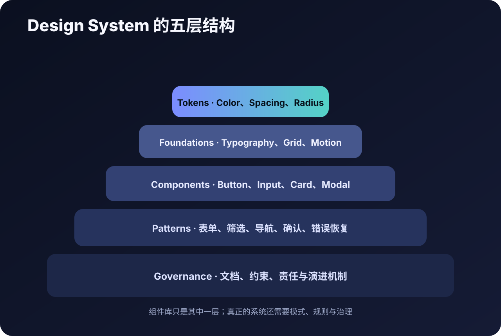

# Design System 到底是什么



## 五个容易混淆的概念

| 概念 | 内容 |
|---|---|
| Design Tokens | 颜色、间距、字号、圆角等可复用值 |
| Style Guide | 品牌和视觉使用规范 |
| Component Library | 可复用组件及其状态 |
| Pattern Library | 表单、筛选、确认等组合交互模式 |
| Design System | 上述资产 + 规则 + 文档 + 治理与演进机制 |

## 对个人 Agent Coding 项目的建议

先建立“最小界面契约”：

```text
Foundations
- Semantic Colors
- Typography
- Spacing
- Radius

Components
- Button
- Input
- Card
- Navigation
- Feedback
- Empty State
```

不要为了显得专业，提前制造几十个项目用不到的组件。
