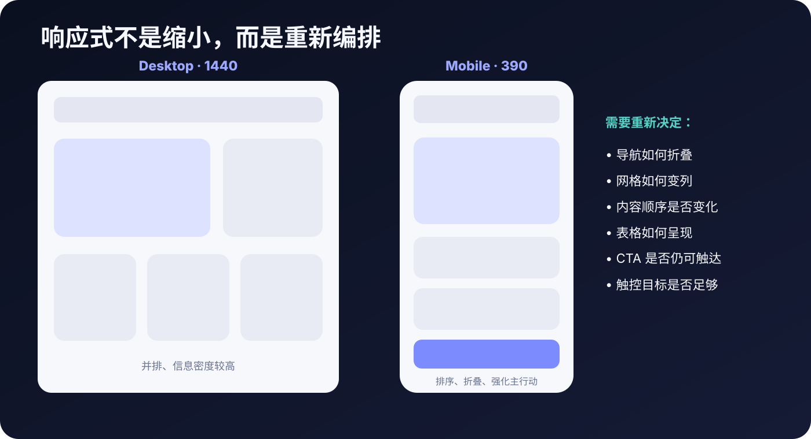

# 小屏能用，键盘也能用

[拖动宽度，看看怎么重新排](https://cafeynman.github.io/agent-ui-design-gitbook/#lesson=responsive)。

响应式不是把整页缩小，而是重新安排内容。[MDN 官方解释](https://developer.mozilla.org/en-US/docs/Learn_web_development/Core/CSS_layout/Responsive_Design)。

再[体验键盘焦点](https://cafeynman.github.io/agent-ui-design-gitbook/#lesson=focus)：不碰鼠标，按 Tab，能知道现在在哪个按钮吗？

给 Agent：

> 检查手机无横向溢出；按 Tab 能完成主要操作；焦点清晰可见。

这只是起点，不代表已经通过完整无障碍审核。[W3C 焦点说明](https://www.w3.org/WAI/WCAG22/Understanding/focus-visible.html)。
