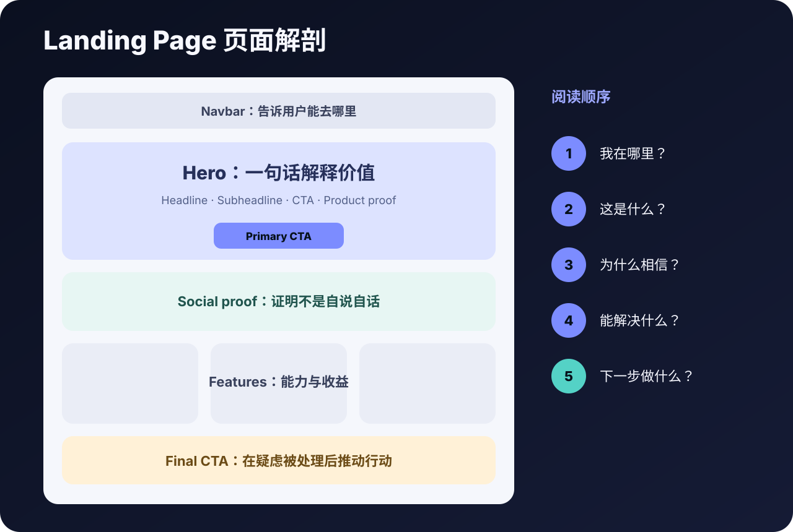

# 开场与层级

先操作，再读文字。

[打开独立实验](https://cafeynman.github.io/agent-ui-design-gitbook/labs/hero-hierarchy/) · [先做零基础课](https://cafeynman.github.io/agent-ui-design-gitbook/#lesson=hero)



如果阅读器不能内嵌，请直接打开实验。
