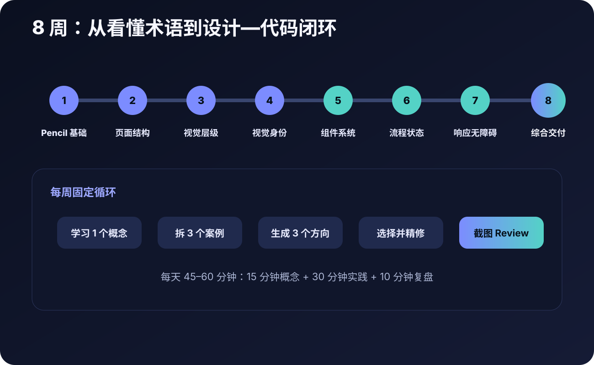

# 怎么学

| 想做什么 | 去哪里 |
| --- | --- |
| 我什么都不懂 | [先做 12 节互动课](https://cafeynman.github.io/agent-ui-design-gitbook/) |
| Agent 说了一个陌生词 | [查词](https://cafeynman.github.io/agent-ui-design-gitbook/#dictionary) |
| 我要做完整产品 | [八周计划](../learning-plan/overview.md) |
| 我想检查结果 | [验收表](../practice/review-and-scoring.md) |

一次学会一个判断，比一次看完一百个术语更有用。
